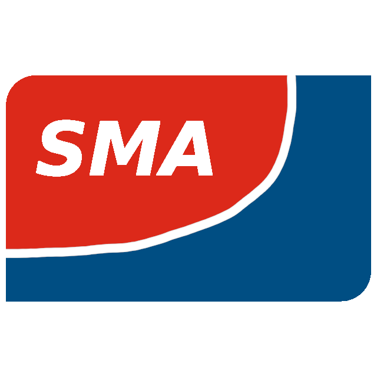

# ioBroker.sma-local

**Tests:** 

## sma-local adapter for ioBroker

Integration of Local SMA devices without cloud connection

## Description

The **ioBroker SMA Local Device Adapter** allows you to regularly monitor and control your SMA device without using the Cloud API

## Compatible Devices:

https://www.sma.de/produkte

* Sunny Tripower X
* Sunny Tripower Smart Energy
* SMA EV Charger

**Unknown Compatibility:**
* Sunny Tripower
* Sunny Boy 
* Sunny Boy Smart Energy
* SMA eCharger
* SMA EV Charger Business

## Changelog
<!--
    Placeholder for the next version (at the beginning of the line):
    ### **WORK IN PROGRESS**
-->
### **WORK IN PROGRESS**
* [TASK] initial release

## License

[Licensed under GPLv3](LICENSE) Copyright (c) 2024 jb-io
